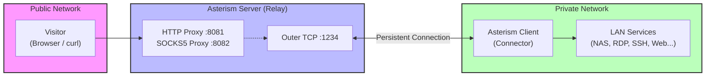

# ✦ Asterism

English | [中文](README_ZH.md)

Asterism is a lightweight reverse proxy for intranet penetration (NAT traversal). It exposes services behind NAT/firewalls to the public network through a relay server with a public IP, enabling external users to access TCP and HTTP services on private networks.

Typical use cases:

- Remotely access a home NAS or router admin panel
- Connect to office RDP, SSH, or other internal services
- Server-to-client message pushing (client hosts a Web API for the server to call)

## Features

- **Cross-platform** — Windows, Linux, macOS, Android, iOS
- **High performance** — Event-driven architecture built on libuv async I/O
- **Protocol support** — HTTP proxy, SOCKS5 proxy (with optional UDP support)
- **Lightweight** — Pure C, no external runtime dependencies, single binary
- **Multi-user** — Multiple clients connect simultaneously, routed by username

## Architecture Overview



**How it works:**

1. The **Client** connects to the Server's Outer port, authenticates with username/password, and establishes a persistent tunnel
2. The **Server** listens for proxy requests (HTTP/SOCKS5) on Inner ports, waiting for visitors
3. A **Visitor** connects to the Server via proxy protocol, specifying the target client's credentials
4. The **Server** forwards the request through the tunnel to the corresponding client, which accesses local/LAN services and returns the response

## Building

### Prerequisites

- CMake >= 2.8
- C compiler (GCC / Clang / MSVC)
- Third-party libraries are bundled in `3rdparty/` (libuv, http-parser) — no extra installation needed

### Build Steps

```bash
mkdir build
cd build
cmake ..
make
```

The output is a single binary: `build/src/asterism/asterism`

### Build with Unit Tests

```bash
mkdir build
cd build
cmake -DUNIT_TEST=ON ..
make
```

## Usage

### Command-Line Options

```
asterism [options]

Options:
  -h, --help                 Show help message
  -v, --verbose              Enable debug log output
  -V, --version              Display version number
  -i, --in-addr <address>    Server proxy listen address (can be specified multiple times)
                             Example: -i http://0.0.0.0:8081
                             Example: -i socks5://0.0.0.0:8082
  -o, --out-addr <address>   Server outer listen address (for client connections)
                             Example: -o tcp://0.0.0.0:1234
  -r, --remote-addr <address> Client connection address to server
                             Example: -r tcp://1.2.3.4:1234
  -u, --user <username>      Client authentication username
  -p, --pass <password>      Client authentication password
  -d, --udp                  Enable SOCKS5 UDP support (disabled by default)
  -t, --udp-timeout <seconds> UDP session idle timeout (0 = no timeout)
  -A, --auth-sessions        Enable HTTP basic authentication for the session list (/sessions)
  -U, --session-user <user>  Username for the session list authentication
  -P, --session-pass <pass>  Password for the session list authentication
```

### Quick Start

**Step 1: Start the Server** (on a machine with a public IP)

```bash
asterism \
  -i http://0.0.0.0:8081 \
  -i socks5://0.0.0.0:8082 \
  -o tcp://0.0.0.0:1234 \
  -v
```

- `-i` sets proxy listen addresses; HTTP and SOCKS5 can run simultaneously
- `-o` sets the port for client connections

**Step 2: Start the Client** (on a machine behind NAT)

```bash
asterism \
  -r tcp://<server_ip>:1234 \
  -u myuser \
  -p mypassword \
  -v
```

The client automatically connects to the server and maintains the tunnel, reconnecting every 10 seconds if disconnected.

**Step 3: Access LAN services through the proxy**

```bash
# Via HTTP proxy
curl "http://192.168.1.100:8080/api" \
  --proxy "http://<server_ip>:8081" \
  --proxy-user "myuser:mypassword"

# Via SOCKS5 proxy
curl "http://192.168.1.100:8080/api" \
  --proxy "socks5://<server_ip>:8082" \
  --proxy-user "myuser:mypassword"
```

### Multi-Client Scenario

Multiple clients behind different NATs can connect to the same server simultaneously, each identified by a unique username. Visitors route to different clients by specifying different credentials, accessing each client's local network resources.

```bash
# Client A (home network)
asterism -r tcp://server:1234 -u home -p pass_a -v

# Client B (office network)
asterism -r tcp://server:1234 -u office -p pass_b -v

# Access NAS on home network
curl http://192.168.1.10:5000 --proxy socks5://server:8082 --proxy-user "home:pass_a"

# Access remote desktop on office network
curl http://10.0.0.50:3389 --proxy socks5://server:8082 --proxy-user "office:pass_b"
```

### Querying Active Sessions

You can query the list of currently connected client sessions by sending an HTTP GET request to `/sessions` on the server's HTTP proxy address.

```bash
# Query active sessions
curl http://<server_ip>:<http_port>/sessions
```

By default, this endpoint is public. You can enable HTTP Basic Authentication for `/sessions` using the `-A` / `--auth-sessions` flag, combined with `-U` / `--session-user` and `-P` / `--session-pass`:

```bash
# Start server with sessions list authentication
asterism -i http://0.0.0.0:8081 -o tcp://0.0.0.0:1234 -A -U admin -P admin123

# Query with credentials
curl -u admin:admin123 http://<server_ip>:8081/sessions
```

## System Service Deployment

Asterism provides interactive installation scripts to register client or server modes as background daemons/tasks across multiple operating systems. This allows running both client and server instances on the same host under distinct names.

### Linux (systemd)
- **Install Service**: `sudo ./install/install_service.sh` (prompts for Mode and configuration).
- **Uninstall Service**: `sudo ./install/uninstall_service.sh` (prompts for which service to uninstall).
- **Service Names**: `asterism-server.service` or `asterism-client.service`
- **Installation Directory**: `/opt/asterism/` (shared binary directory)
- **Management Commands**:
  ```bash
  sudo systemctl status asterism-server      # Check status
  sudo systemctl restart asterism-server     # Restart service
  sudo journalctl -u asterism-server -f      # View real-time logs
  ```

### macOS (launchd)
- **Install Service**: `sudo ./install/install_service_macos.sh` (prompts for Mode and configuration).
- **Uninstall Service**: `sudo ./install/uninstall_service_macos.sh` (prompts for which service to uninstall).
- **Service Labels**: `com.asterism.server` or `com.asterism.client`
- **Installation Location**: `/usr/local/bin/asterism` (shared binary)
- **Management Commands**:
  ```bash
  sudo launchctl list com.asterism.server                     # Check status
  sudo launchctl unload /Library/LaunchDaemons/com.asterism.server.plist  # Stop service
  tail -f /usr/local/var/log/com.asterism.server/asterism.log     # View logs
  ```

### Windows (Task Scheduler)
- **Install Task**: Run `PowerShell` as Administrator, then: `.\install\install_task_windows.ps1` (prompts for Mode and configuration, sets task to run at boot under the `SYSTEM` account).
- **Uninstall Task**: `.\install\uninstall_task_windows.ps1`
- **Task Names**: `AsterismServer` or `AsterismClient`
- **Installation Directory**: `C:\Program Files\Asterism\` (shared binary directory)
- **Management Commands**:
  ```powershell
  schtasks /Query /TN AsterismServer          # Check status
  schtasks /End /TN AsterismServer            # Stop task
  schtasks /Run /TN AsterismServer            # Start/Run task
  ```

## Project Structure

```
asterism/
├── 3rdparty/               # Third-party dependencies
│   ├── libuv/              # Cross-platform async I/O library
│   └── http-parser/        # HTTP protocol parser
├── src/asterism/           # Core source code
│   ├── main.c              # Entry point and CLI argument parsing
│   ├── asterism.h/.c       # Public API interface
│   ├── asterism_core.h/.c  # Core: event loop, session management, protocol definitions
│   ├── asterism_stream.*   # TCP stream abstraction
│   ├── asterism_inner_*    # Proxy protocol implementations (HTTP / SOCKS5)
│   ├── asterism_outer_*    # Outer connection listener (client connections)
│   ├── asterism_connector_*# Client-side connector
│   ├── asterism_requestor_*# Request forwarding
│   ├── asterism_responser_*# Response forwarding
│   └── test/               # Unit tests
├── install/                # systemd service installation scripts
├── doc/                    # Documentation resources
├── CMakeLists.txt          # Build configuration
├── README.md               # English documentation
└── README_ZH.md            # Chinese documentation
```
