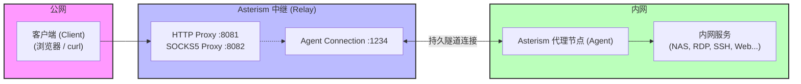

# ✦ Asterism

[English](README.md) | 中文

Asterism 是一个轻量级的内网穿透（NAT 穿透）反向代理工具。它通过一台具有公网 IP 的中继服务，将内网服务暴露到公网，使外部客户端能够访问 NAT/防火墙后面的 TCP 和 HTTP 服务。

典型应用场景：

- 远程访问家中的 NAS、路由器管理界面
- 连接公司内网的远程桌面（RDP）、SSH 等服务
- 中继向代理节点推送消息（代理节点建立 Web API 供中继或客户端调用）
- **Portal 模式**（端口转发）：通过中继与代理节点之间的隧道将本地端口映射到远端服务

## 术语解释

为了避免混淆，Asterism 统一使用以下术语：
- **Relay（中继）**：运行在具有公网 IP 的服务器上，负责监听代理节点的接入请求以及客户端的代理请求。
- **Agent（代理节点）**：运行在内网环境中的守护程序，主动连接 Relay 并负责将流量转发到具体的内网服务。
- **Client（客户端）**：最终使用代理服务的外部程序（如浏览器、curl 等）。
- **Portal（传送门）**：一种专用的端口转发配置，通过中继与代理节点之间的隧道将本地端口桥接到远端目标端口。

## 特性

- **跨平台** — 支持 Windows、Linux、macOS、Android、iOS
- **高性能** — 基于 libuv 异步 I/O，事件驱动架构
- **协议支持** — HTTP 代理、SOCKS5 代理（含可选 UDP 支持）
- **轻量级** — 纯 C 实现，无外部运行时依赖，单一可执行文件
- **多用户** — 支持多个代理节点同时接入，通过用户名区分路由
- **Portal 支持** — 轻松在代理隧道上实现固定端口转发

## 架构概览



**工作原理：**

1. **Agent** 启动后主动连接 Relay 的代理接入端口（`-o`），完成用户名/密码认证，建立持久隧道。
2. **Relay** 在代理端口（`-i`）监听代理请求（HTTP/SOCKS5），等待客户端连接。
3. **Client** 通过代理协议连接 Relay，指定目标 Agent 的用户名/密码凭据。
4. **Relay** 将请求通过隧道转发给对应的 Agent，Agent 访问本地/内网服务后将响应原路返回。

## 编译

### 编译依赖

- CMake >= 2.8
- C 编译器（GCC / Clang / MSVC）
- 第三方库已包含在 `3rdparty/` 目录中（libuv、http-parser），无需额外安装

### 构建步骤

```bash
mkdir build
cd build
cmake ..
cmake --build . --config Release
```

构建产物为单一可执行文件：`build/src/asterism/asterism`（Windows 下为 `asterism.exe`）。

### 构建单元测试

```bash
mkdir build
cd build
cmake -DUNIT_TEST=ON ..
cmake --build . --config Debug
```

## 使用方法

### 命令行参数

```
asterism [options]

选项:
  -h, --help                 显示帮助信息
  -v, --verbose              开启调试日志输出
  -V, --version              显示版本号
  -i, --in-addr <address>    Relay 代理监听地址（可多次指定）
                             示例: -i http://0.0.0.0:8081
                             示例: -i socks5://0.0.0.0:8082
  -o, --out-addr <address>   Relay 代理节点连接监听地址
                             示例: -o tcp://0.0.0.0:1234
  -r, --remote-addr <address> Agent 中继连接地址
                             示例: -r tcp://1.2.3.4:1234
  -u, --user <username>      Agent 认证用户名
  -p, --pass <password>      Agent 认证密码
  -d, --udp                  启用 SOCKS5 UDP 支持（默认关闭）
  -t, --udp-timeout <seconds> UDP 会话空闲超时（0 表示不超时）
  -A, --auth-sessions        启用会话列表接口（/sessions）的 HTTP Basic 认证
  -U, --session-user <user>  会话列表认证用户名
  -P, --session-pass <pass>  会话列表认证密码
```

### 快速开始

**第一步：启动中继（Relay）**（在有公网 IP 的机器上）

```bash
asterism \
  -i http://0.0.0.0:8081 \
  -i socks5://0.0.0.0:8082 \
  -o tcp://0.0.0.0:1234 \
  -v
```

- `-i` 指定代理监听地址，支持同时开启 HTTP 和 SOCKS5 代理。
- `-o` 指定 Agent 接入端口。

**第二步：启动代理节点（Agent）**（在内网机器上）

```bash
asterism \
  -r tcp://<relay_ip>:1234 \
  -u myuser \
  -p mypassword \
  -v
```

Agent 会自动连接 Relay 并保持隧道，断线后每 10 秒自动重连。

**第三步：通过代理访问内网服务**

```bash
# 通过 HTTP 代理
curl "http://192.168.1.100:8080/api" \
  --proxy "http://<relay_ip>:8081" \
  --proxy-user "myuser:mypassword"

# 通过 SOCKS5 代理
curl "http://192.168.1.100:8080/api" \
  --proxy "socks5://<relay_ip>:8082" \
  --proxy-user "myuser:mypassword"
```

---

### Portal 模式 (端口转发)

你可以使用 `local/app.js` 脚本来启用 Portals（传送门）模式。它能把本地的一个端口通过 Relay 的 HTTP CONNECT 隧道转发到指定目标：

**config.json 配置：**
```json
[
  {
    "name": "test_portal",
    "relayHost": "127.0.0.1",
    "relayPort": 8011,
    "username": "myuser",
    "password": "mypassword",
    "targetHost": "192.168.1.100",
    "targetPort": 3389,
    "localHost": "0.0.0.0",
    "localPort": 6102
  }
]
```

**运行 Portal：**
```bash
node local/app.js local/config.json
```
这将在本地监听 `6102` 端口，并将所有连接请求通过隧道映射到 Agent 所在内网中的 `192.168.1.100:3389`。

---

### 多代理节点场景

多个内网 Agent 可以同时接入同一台 Relay，使用不同的用户名进行区分。外部客户端通过指定不同的 Agent 凭据，即可路由访问各自内网中的资源。

```bash
# 代理节点 A（家庭网络）
asterism -r tcp://relay:1234 -u home -p pass_a -v

# 代理节点 B（公司网络）
asterism -r tcp://relay:1234 -u office -p pass_b -v

# 访问家庭网络中的 NAS
curl http://192.168.1.10:5000 --proxy socks5://relay:8082 --proxy-user "home:pass_a"

# 访问公司网络中的远程桌面
curl http://10.0.0.50:3389 --proxy socks5://relay:8082 --proxy-user "office:pass_b"
```

### 查询在线 Agent 会话列表

您可以通过向 Relay 的 HTTP 代理地址发送 HTTP GET 请求访问 `/sessions`，来查询当前已连接的 Agent 会话列表：

```bash
# 查询在线 Agent 列表
curl http://<relay_ip>:<http_port>/sessions
```

默认情况下该接口是公开的。您可以通过 `-A` / `--auth-sessions` 选项开启 HTTP Basic 认证，并结合 `-U` / `--session-user` 和 `-P` / `--session-pass` 设置查询接口的用户名与密码：

```bash
# 启动 Relay 并开启会话列表验证
asterism -i http://0.0.0.0:8081 -o tcp://0.0.0.0:1234 -A -U admin -P admin123

# 携带账密查询
curl -u admin:admin123 http://<relay_ip>:8081/sessions
```

## 系统服务部署

Asterism 提供了交互式安装脚本，用于在多个操作系统上将 Agent 或 Relay 模式注册为后台守护进程/计划任务。这允许在同一台机器上以不同的名称同时运行 Agent 和 Relay 实例。

### Linux (systemd)
- **安装服务**：`sudo ./install/install_service.sh`（提示选择模式与输入配置）。
- **卸载服务**：`sudo ./install/uninstall_service.sh`（提示选择要卸载的服务）。
- **服务名称**：`asterism-relay.service` 或 `asterism-agent.service`
- **安装目录**：`/opt/asterism/`（共享可执行文件目录）
- **常用管理命令**：
  ```bash
  sudo systemctl status asterism-relay      # 查看状态
  sudo systemctl restart asterism-relay     # 重启服务
  sudo journalctl -u asterism-relay -f      # 实时查看日志
  ```

### macOS (launchd)
- **安装服务**：`sudo ./install/install_service_macos.sh`（提示选择模式与输入配置）。
- **卸载服务**：`sudo ./install/uninstall_service_macos.sh`（提示选择要卸载的服务）。
- **服务标签**：`com.asterism.relay` 或 `com.asterism.agent`
- **安装位置**：`/usr/local/bin/asterism`（共享可执行文件）
- **常用管理命令**：
  ```bash
  sudo launchctl list com.asterism.relay                     # 查看状态
  sudo launchctl unload /Library/LaunchDaemons/com.asterism.relay.plist  # 停止服务
  tail -f /usr/local/var/log/com.asterism.relay/asterism.log     # 查看日志
  ```

### Windows (任务计划程序)
- **安装任务**：以管理员权限运行 `PowerShell`，然后执行：`.\install\install_task_windows.ps1`（提示选择模式与输入配置，注册为系统启动时自动运行的 `SYSTEM` 任务）。
- **卸载任务**：`.\install\uninstall_task_windows.ps1`
- **任务名称**：`AsterismRelay` 或 `AsterismAgent`
- **安装目录**：`C:\Program Files\Asterism\`（共享可执行文件目录）
- **常用管理命令**：
  ```powershell
  schtasks /Query /TN AsterismRelay          # 查看状态
  schtasks /End /TN AsterismRelay            # 停止任务
  schtasks /Run /TN AsterismRelay            # 启动/运行任务
  ```

## 项目结构

```
asterism/
├── 3rdparty/               # 第三方依赖
│   ├── libuv/              # 跨平台异步 I/O 库
│   └── http-parser/        # HTTP 协议解析器
├── src/asterism/           # 核心源码
│   ├── main.c              # 程序入口与命令行解析
│   ├── asterism.h/.c       # 公共 API 接口
│   ├── asterism_core.h/.c  # 核心：事件循环、会话管理、协议定义
│   ├── asterism_stream.*   # TCP 流抽象
│   ├── asterism_inner_*    # 代理协议实现（HTTP / SOCKS5）
│   ├── asterism_outer_*    # 外部连接监听（Agent 接入）
│   ├── asterism_connector_*# Agent 连接器
│   ├── asterism_requestor_*# 请求转发
│   ├── asterism_responser_*# 响应转发
│   └── test/               # 单元测试
├── install/                # 服务安装与卸载脚本
├── local/                  # Portal 模式配置与脚本
│   ├── app.js              # Portal 脚本
│   └── config.json         # Portal 配置文件
├── CMakeLists.txt          # 构建配置
├── README.md               # 英文文档
└── README_ZH.md            # 中文文档
```

## 联系方式

- Email: 12178761@qq.com
- QQ: 12178761
- 微信: mengchao1102

如果本项目对您有帮助，欢迎 Star 支持！
