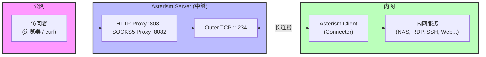

# ✦ Asterism

[English](README.md) | 中文

Asterism 是一个轻量级的内网穿透反向代理工具。它通过一台具有公网 IP 的中继服务器，将内网客户端的服务安全地暴露到公网，使外部用户能够访问 NAT/防火墙后面的 TCP 和 HTTP 服务。

典型应用场景：

- 远程访问家中的 NAS、路由器管理界面
- 连接公司内网的远程桌面（RDP）、SSH 等服务
- 服务器向内网客户端推送消息（客户端建立 Web API 供服务器调用）

## 特性

- **跨平台** — 支持 Windows、Linux、macOS、Android、iOS
- **高性能** — 基于 libuv 异步 I/O，事件驱动架构
- **协议支持** — HTTP 代理、SOCKS5 代理（含可选 UDP 支持）
- **轻量级** — 纯 C 实现，无外部运行时依赖，单一可执行文件
- **多用户** — 支持多个客户端同时接入，通过用户名区分路由

## 架构概览



**工作流程：**

1. **客户端**启动后主动连接服务器的 Outer 端口，完成用户名/密码认证，建立持久隧道
2. **服务器**在 Inner 端口监听代理请求（HTTP/SOCKS5），等待访问者连接
3. **访问者**通过代理协议连接服务器，指定目标客户端的用户名/密码
4. **服务器**将请求通过隧道转发给对应客户端，客户端访问本地/内网服务后将响应原路返回

## 编译

### 依赖

- CMake >= 2.8
- C 编译器（GCC / Clang / MSVC）
- 第三方库已包含在 `3rdparty/` 目录中（libuv、http-parser），无需额外安装

### 构建步骤

```bash
mkdir build
cd build
cmake ..
make
```

构建产物为单一可执行文件：`build/src/asterism/asterism`

### 构建单元测试

```bash
mkdir build
cd build
cmake -DUNIT_TEST=ON ..
make
```

## 使用方法

### 命令行参数

```
asterism [options]

选项:
  -h, --help                 显示帮助信息
  -v, --verbose              开启调试日志输出
  -V, --version              显示版本号
  -i, --in-addr <address>    服务器代理监听地址（可多次指定）
                             示例: -i http://0.0.0.0:8081
                             示例: -i socks5://0.0.0.0:8082
  -o, --out-addr <address>   服务器外部监听地址（供客户端连接）
                             示例: -o tcp://0.0.0.0:1234
  -r, --remote-addr <address> 客户端连接的服务器地址
                             示例: -r tcp://1.2.3.4:1234
  -u, --user <username>      客户端认证用户名
  -p, --pass <password>      客户端认证密码
  -d, --udp                  启用 SOCKS5 UDP 支持（默认关闭）
  -t, --udp-timeout <seconds> UDP 会话空闲超时（0 表示不超时）
  -A, --auth-sessions        启用会话列表接口（/sessions）的 HTTP Basic 认证
  -U, --session-user <user>  会话列表认证用户名
  -P, --session-pass <pass>  会话列表认证密码
```

### 快速开始

**第一步：启动服务器**（在有公网 IP 的机器上）

```bash
asterism \
  -i http://0.0.0.0:8081 \
  -i socks5://0.0.0.0:8082 \
  -o tcp://0.0.0.0:1234 \
  -v
```

- `-i` 指定代理监听地址，支持同时开启 HTTP 和 SOCKS5 代理
- `-o` 指定客户端接入端口

**第二步：启动客户端**（在内网机器上）

```bash
asterism \
  -r tcp://<服务器IP>:1234 \
  -u myuser \
  -p mypassword \
  -v
```

客户端会自动连接服务器并保持隧道，断线后每 10 秒自动重连。

**第三步：通过代理访问内网服务**

```bash
# 通过 HTTP 代理
curl "http://192.168.1.100:8080/api" \
  --proxy "http://<服务器IP>:8081" \
  --proxy-user "myuser:mypassword"

# 通过 SOCKS5 代理
curl "http://192.168.1.100:8080/api" \
  --proxy "socks5://<服务器IP>:8082" \
  --proxy-user "myuser:mypassword"
```

### 多客户端场景

多个内网客户端可以同时接入同一台服务器，使用不同的用户名进行区分。访问者通过指定不同的用户名/密码来路由到不同的客户端，从而访问各自内网中的资源。

```bash
# 客户端 A（家庭网络）
asterism -r tcp://server:1234 -u home -p pass_a -v

# 客户端 B（公司网络）
asterism -r tcp://server:1234 -u office -p pass_b -v

# 访问家庭网络中的 NAS
curl http://192.168.1.10:5000 --proxy socks5://server:8082 --proxy-user "home:pass_a"

# 访问公司网络中的远程桌面
curl http://10.0.0.50:3389 --proxy socks5://server:8082 --proxy-user "office:pass_b"
```

### 查询当前在线会话 (Sessions)

您可以通过向服务端的 HTTP 代理地址发送 HTTP GET 请求访问 `/sessions`，来查询当前已连接的内网客户端会话列表：

```bash
# 查询在线客户端列表
curl http://<server_ip>:<http_port>/sessions
```

默认情况下该接口是公开的。您可以通过 `-A` / `--auth-sessions` 选项开启 HTTP Basic 认证，并结合 `-U` / `--session-user` 和 `-P` / `--session-pass` 设置查询接口的用户名与密码：

```bash
# 启动服务端并开启会话列表验证
asterism -i http://0.0.0.0:8081 -o tcp://0.0.0.0:1234 -A -U admin -P admin123

# 携带账密查询
curl -u admin:admin123 http://<server_ip>:8081/sessions
```

## 系统服务部署

Asterism 提供了交互式安装脚本，用于在多个操作系统上将客户端或服务端模式注册为后台守护进程/计划任务。这允许在同一台机器上以不同的名称同时运行客户端和服务端实例。

### Linux (systemd)
- **安装服务**：`sudo ./install/install_service.sh`（提示选择模式与输入配置）。
- **卸载服务**：`sudo ./install/uninstall_service.sh`（提示选择要卸载的服务）。
- **服务名称**：`asterism-server.service` 或 `asterism-client.service`
- **安装目录**：`/opt/asterism/`（共享可执行文件目录）
- **常用管理命令**：
  ```bash
  sudo systemctl status asterism-server      # 查看状态
  sudo systemctl restart asterism-server     # 重启服务
  sudo journalctl -u asterism-server -f      # 实时查看日志
  ```

### macOS (launchd)
- **安装服务**：`sudo ./install/install_service_macos.sh`（提示选择模式与输入配置）。
- **卸载服务**：`sudo ./install/uninstall_service_macos.sh`（提示选择要卸载的服务）。
- **服务标签**：`com.asterism.server` 或 `com.asterism.client`
- **安装位置**：`/usr/local/bin/asterism`（共享可执行文件）
- **常用管理命令**：
  ```bash
  sudo launchctl list com.asterism.server                     # 查看状态
  sudo launchctl unload /Library/LaunchDaemons/com.asterism.server.plist  # 停止服务
  tail -f /usr/local/var/log/com.asterism.server/asterism.log     # 查看日志
  ```

### Windows (任务计划程序)
- **安装任务**：以管理员权限运行 `PowerShell`，然后执行：`.\install\install_task_windows.ps1`（提示选择模式与输入配置，注册为系统启动时自动运行的 `SYSTEM` 任务）。
- **卸载任务**：`.\install\uninstall_task_windows.ps1`
- **任务名称**：`AsterismServer` 或 `AsterismClient`
- **安装目录**：`C:\Program Files\Asterism\`（共享可执行文件目录）
- **常用管理命令**：
  ```powershell
  schtasks /Query /TN AsterismServer          # 查看状态
  schtasks /End /TN AsterismServer            # 停止任务
  schtasks /Run /TN AsterismServer            # 启动/运行任务
  ```

## 项目结构

```
asterism/
├── 3rdparty/               # 第三方依赖
│   ├── libuv/              # 跨平台异步 I/O 库
│   └── http-parser/        # HTTP 协议解析器
├── src/asterism/           # 核心源码
│   ├── main.c              # 程序入口与命令行解析
│   ├── asterism.h/.c       # 公共 API 接口
│   ├── asterism_core.h/.c  # 核心：事件循环、会话管理、协议定义
│   ├── asterism_stream.*   # TCP 流抽象
│   ├── asterism_inner_*    # 代理协议实现（HTTP / SOCKS5）
│   ├── asterism_outer_*    # 外部连接监听（客户端接入）
│   ├── asterism_connector_*# 客户端连接器
│   ├── asterism_requestor_*# 请求转发
│   ├── asterism_responser_*# 响应转发
│   └── test/               # 单元测试
├── install/                # systemd 服务安装脚本
├── doc/                    # 文档资源
├── CMakeLists.txt          # 构建配置
├── README.md               # 英文文档
└── README_ZH.md            # 中文文档
```

## 联系方式

- Email: 12178761@qq.com
- QQ: 12178761
- 微信: mengchao1102

如果本项目对您有帮助，欢迎 Star 支持！
